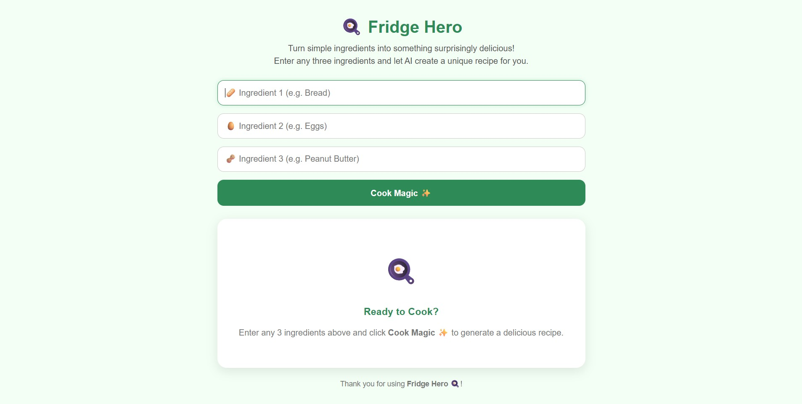
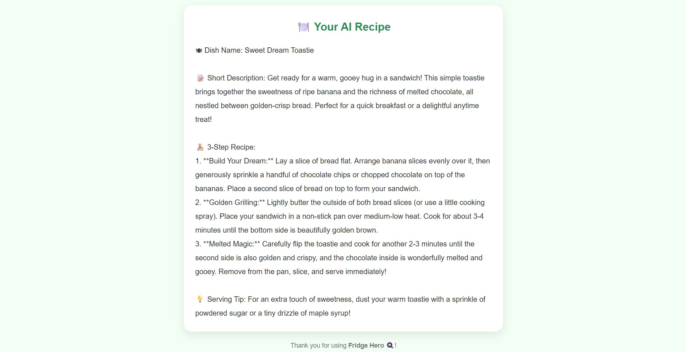

# 🍳 Fridge Hero

An AI-powered recipe generator that helps users create delicious recipes using only three ingredients available in their fridge.

## 🚀 Overview

Fridge Hero is a simple web application built using HTML, CSS, JavaScript, and Google's Gemini API. Users enter three ingredients, click **Cook Magic ✨**, and the AI generates a creative recipe including:

* 🍽️ Dish Name
* 📝 Short Description
* 👨‍🍳 3-Step Recipe
* 💡 Serving Tip

The project is designed to be responsive, user-friendly, and mobile-friendly.

---

## ✨ Features

* Enter any 3 ingredients
* AI-powered recipe generation using Gemini API
* Creative dish names
* Short recipe descriptions
* 3-step cooking instructions
* Serving suggestions
* Input validation
* Loading state while generating recipes
* Responsive design for desktop and mobile

---

## 🛠️ Technologies Used

* HTML5
* CSS3
* JavaScript (ES6)
* Gemini API

---

## 📂 Project Structure

```text
Fridge-Hero/
│
├── index.html
├── style.css
├── script.js
└── README.md
```

---

## 📸 Screenshots

### Home Page


### Entering Ingredients



### Generated Recipe Output



---

## ⚙️ How to Run

1. Clone the repository:

```bash
git clone https://github.com/Shreyaa-J/Fridge-Hero.git
```

2. Open the project folder.

3. Open `script.js`.

4. Replace:

```javascript
const API_KEY = "YOUR_API_KEY";
```

with your Gemini API key.

5. Run `index.html` using Live Server or any local server.

---

## 🧠 How It Works

1. User enters three ingredients.
2. Clicks **Cook Magic ✨**.
3. Ingredients are sent to Gemini API.
4. Gemini generates:

   * Dish Name
   * Description
   * 3-Step Recipe
   * Serving Tip
5. Recipe is displayed in a styled recipe card.

---

## 📌 Sample Input

* Bread
* Eggs
* Peanut Butter

## 📌 Sample Output

**Dish Name:** PB & Egg Toast Bites

**Short Description:** A quick and delicious snack made with toasted bread, eggs, and creamy peanut butter.

**3-Step Recipe:**

1. Whisk the eggs and dip bread slices.
2. Cook until golden brown.
3. Spread peanut butter and serve warm.

**Serving Tip:** Add a drizzle of honey for extra flavor.

---

## 🎯 Learning Outcomes

Through this project, I learned:

* API Integration using Fetch API
* Prompt Engineering
* DOM Manipulation
* Async/Await in JavaScript
* Error Handling
* Responsive Web Design
* User Experience Design

---

## 👩‍💻 Author

**Shreya J.**


